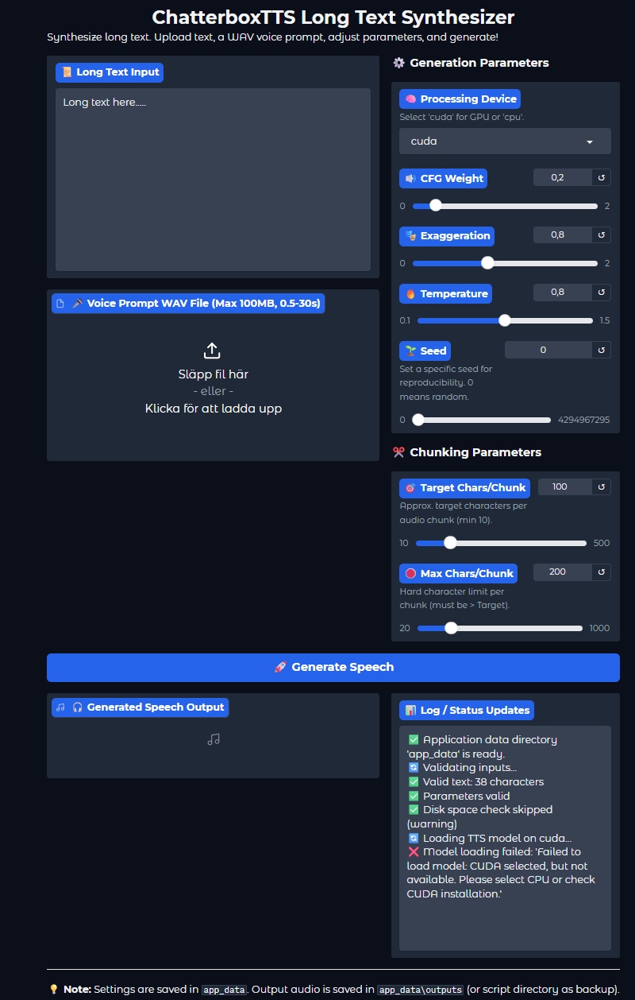

# ChatterBoxViz

A Gradio-based interface for synthesizing long text into speech using **Chatterbox TTS**.

### Table of Contents

1. [Acknowledgments](#acknowledgments)  
2. [Overview](#overview)  
3. [Prerequisites](#prerequisites)  
4. [Installation](#installation)  
5. [Usage](#usage)  
6. [Application Structure](#application-structure)  
7. [License](#license)  

---

## Acknowledgments

- **Chatterbox TTS** was created by **Resemble AI**.  
  Visit the original repository for more details and model updates:  
  [https://github.com/resemble-ai/chatterbox](https://github.com/resemble-ai/chatterbox)  
- Portions of this UI borrow design ideas from the Chatterbox TTS server examples and their Hugging Face Gradio space.  
- The following screenshot shows how the Gradio interface looks when running **ChatterBoxViz**:

  

---

## Overview

**ChatterBoxViz** is a Gradio-based application that allows you to paste or upload long-form text and generate a high-quality speech output via **Chatterbox TTS**. Internally, it:

1. Splits lengthy text into manageable chunks (using NLTK’s **punkt** tokenizer).  
2. Feeds each chunk (and an optional WAV voice prompt) into the Chatterbox TTS model.  
3. Concatenates the resulting audio tensors into a single WAV file.  
4. Displays progress and status logs throughout the generation process.  

You can adjust parameters such as CFG weight, temperature, exaggeration, chunk size, and random seed. **Python 3.10+** is required.

---

## Prerequisites

1. **Operating System**  
   - Linux or Windows (PowerShell or Command Prompt recommended on Windows).  
2. **Python Version**  
   - Python ≥ 3.10.x.  
3. **CUDA (optional)**  
   - If you plan to use an NVIDIA GPU, install a compatible NVIDIA driver and CUDA toolkit (e.g., CUDA 12.6).  

---

## Installation

1. **Clone this repository (or copy the files)**  
   ```bash
   git clone https://your-repo-url/ChatterBoxViz.git
   cd ChatterBoxViz
   ````

2. **Create and activate a virtual environment**

   ```bash
   python3.10 -m venv venv
   source venv/bin/activate        # Linux (bash/zsh)
   # .\venv\Scripts\activate      # Windows PowerShell
   ```

3. **Upgrade pip**

   ```bash
   pip install --upgrade pip
   ```

4. **Install core Python dependencies**

   ```bash
   pip install -r requirements.txt
   ```

5. **(Optional) Install CUDA-enabled PyTorch & Torchaudio (Linux/Windows)**
   *   Go to the [PyTorch Get Started page](https://pytorch.org/get-started/locally/).
   *   Select your OS, Package (Pip), Compute Platform (CUDA version if you have an NVIDIA GPU, or CPU).
   *   Copy the generated command and run it in your activated virtual environment.
<br><br>
   ### Example for CUDA 12.6:

   * **You might need to uninstall torch and torchaudio before installing CUDA-enabled versions.**
    
   ```bash
   pip uninstall torch torchaudio
   ```

   * **Linux** (bash/zsh):

   ```bash
   pip install torch torchvision torchaudio --index-url https://download.pytorch.org/whl/cu126
   ```

   * **Windows** (PowerShell or Command Prompt):

   ```powershell
   pip install torch torchvision torchaudio --index-url https://download.pytorch.org/whl/cu126
   ```

7. **Verify NLTK’s Punkt tokenizer**
   On first run, **ChatterBoxViz** will attempt to download the `punkt` tokenizer automatically. To pre-install it manually:

   ```bash
   python -c "import nltk; nltk.download('punkt')"
   ```

---

## Usage

1. **Launch the application**

   ```bash
   python ChatterBoxViz.py
   ```

   You should see output similar to:

   ```
   CONSOLE: Initial settings loaded for UI: Device=cpu, Target Chars=100, Seed=0, Prompt=None
   Running on local URL:  http://127.0.0.1:7860
   ```

2. **Open the Gradio interface**
   In your web browser, navigate to the displayed URL (e.g., `http://127.0.0.1:7860`). You will see:

   * **Long Text Input**
     A large text area where you can paste or type your text.
   * **Voice Prompt WAV File** (optional)
     Upload a `.wav` file (about 10s) if you want the synthesized voice to match a reference speaker.
   * **Generation Parameters** (right panel)

     * **Processing Device**: select `cuda` (if you installed CUDA-enabled PyTorch) or `cpu`.
     * **CFG Weight** (0 – 2): controls how strongly sampling is guided by the reference prompt.
     * **Exaggeration** (0 – 2): controls emotional “exaggeration” of the synthesized voice.
     * **Temperature** (0.1 – 1.5): sampling “randomness.”
     * **Seed** (0 – 4294967295): `0` means random; any other integer fixes the seed for reproducibility.
   * **Chunking Parameters** (below Generation Parameters)

     * **Target Chars/Chunk** (10 – 500): approximate chunk size (in characters).
     * **Max Chars/Chunk** (20 – 1000): hard limit per chunk (must ≥ Target).
   * **Generate Speech** (bottom)
     A blue button to begin synthesis.
   * **Generated Speech Output** (bottom-left)
     An audio player that appears once synthesis is complete.
   * **Log / Status Updates** (bottom-right)
     A live status window that logs validations, model loading, chunk synthesis progress, and final output.

3. **Enter or paste long text**

   * Type or paste your text into **Long Text Input**.
   * (Optional) Upload a `.wav` voice prompt (0.5 s – 30 s, ≤ 100 MB) to guide the speaker’s voice.

4. **Adjust parameters (optional)**

   * **Processing Device**:

     * Choose `cuda` to run on GPU (if you installed the CUDA build of PyTorch).
     * Choose `cpu` to run on the CPU.
   * **CFG Weight**: Larger values bias the model more heavily toward the prompt’s voice pattern.
   * **Exaggeration**: Controls emotional expressiveness.
   * **Temperature**: Sampling “randomness.” Lower values produce more deterministic output.
   * **Seed**: Use `0` for a new random seed each run; otherwise set a fixed 32-bit integer for reproducibility.
   * **Chunking Parameters**:

     * **Target Chars/Chunk**: Aim size for each text chunk.
     * **Max Chars/Chunk**: Hard upper limit per chunk (must be ≥ Target).

5. **Click “Generate Speech”**

   * The **Log / Status Updates** window will show:

     1. Input validation (text length, prompt format, parameters).
     2. Model loading on the selected device.
     3. Text chunking and synthesis progress (chunk-by-chunk).
     4. Merging of all audio chunks.
     5. Final confirmation, e.g.:

        ```
        🎉 Success! Audio duration: 42.87s. Output: chatterbox_output_2023-08-15_14-30-05.wav
        ✅ Done!
        ```

6. **Retrieve the output**

   * Once synthesis finishes, an audio player appears in **Generated Speech Output**.
   * The WAV file is saved under:

     ```
     ./app_data/outputs/chatterbox_output_<timestamp>.wav
     ```
   * If saving to `app_data/outputs` fails (e.g., insufficient permissions), a backup file named `chatterbox_output_backup_<timestamp>.wav` will be created in the script’s directory.


## License

  Because MIT is permissive, you may redistribute or modify Chatterbox TTS (or any code derived from it) provided you preserve the original MIT license text.

```
```
