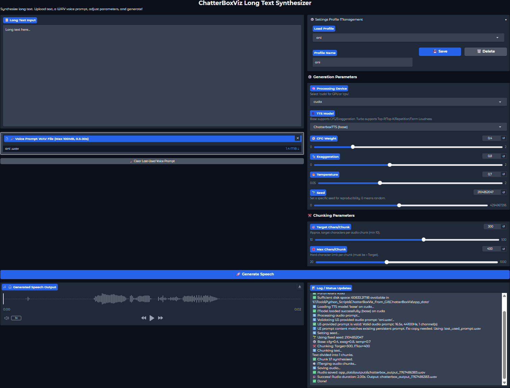
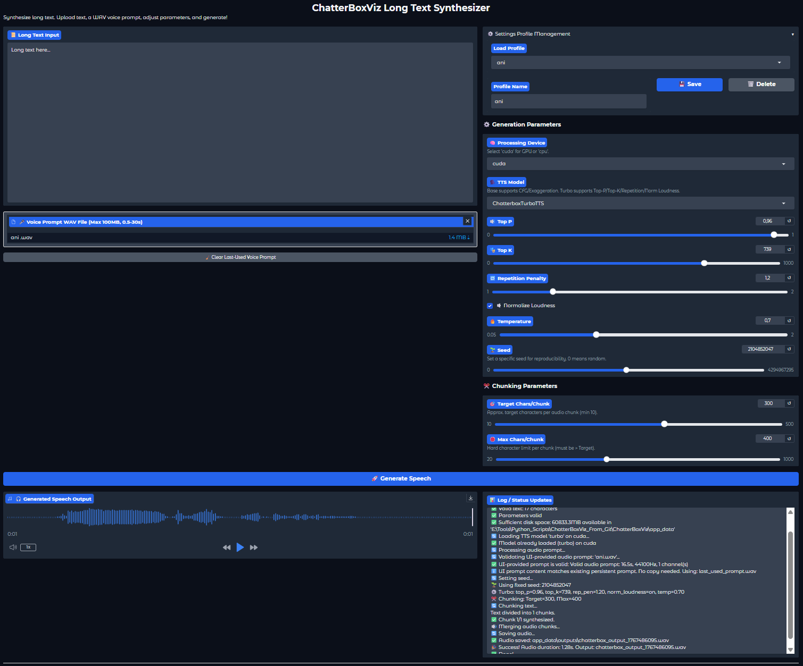

# ChatterBoxViz

**ChatterBoxViz** is a Gradio-based desktop/web UI for synthesizing **long-form text into speech**
using **Resemble AI’s Chatterbox TTS models** — both **Base** and **Turbo**.

It is designed for:
- long texts (articles, stories, transcripts)
- optional voice prompting
- reproducible or random generation
- clear progress logging
- minimal manual setup once installed

---

## Features

- ✅ **Supports two models**
  - **ChatterboxTTS (Base)** — CFG + Exaggeration
  - **ChatterboxTurboTTS (Turbo)** — Top-P, Top-K, Repetition Penalty, Loudness normalization
- 🔁 **Automatic UI adaptation** when switching models
- 📦 **Profile management**
  - Save / load named parameter profiles
  - Optional per-profile voice prompt
- ✂️ **Intelligent text chunking** for long inputs
- 🎧 **Single merged WAV output**
- 🌱 **Deterministic or random seeds**
- 🧠 **CPU or CUDA execution**
- 📊 **Detailed, truthful status logging**

---
## Screenshot
Chatterbox (Base)




Chatterbox (Turbo)



---
## Requirements

- **Python** ≥ 3.10 (tested on 3.11)
- **Linux or Windows**
- **Optional GPU**
  - NVIDIA GPU + CUDA
  - CUDA 12.x recommended

---

## Installation

### 1) Clone the repository

```bash
git clone https://github.com/Rakile/ChatterBoxViz.git
cd ChatterBoxViz
```

### 2) Create and activate a virtual environment

```bash
python3.11 -m venv venv
source venv/bin/activate        # Linux
# .\venv\Scripts\activate    # Windows
```

### 3) Upgrade pip

```bash
python -m pip install --upgrade pip
```

### 4) Install dependencies

```bash
pip install -r requirements.txt
```

### 5) (Optional) Install CUDA-enabled PyTorch

Follow the official PyTorch instructions:
https://pytorch.org/get-started/locally/

Example for CUDA 12.6:

```bash
pip install torch==2.6.0 torchaudio==2.6.0 --force-reinstall --index-url https://download.pytorch.org/whl/cu126
```

---

## Usage

### Start the application

```bash
python ChatterBoxViz.py
```

You should see:

```
Running on local URL: http://127.0.0.1:7860
```

Open that URL in your browser.

---

## How it works

1. Paste or type **long text**
2. (Optional) Upload a **voice prompt WAV**
3. Text is split into chunks
4. Each chunk is synthesized
5. Audio chunks are merged
6. Final WAV is saved and playable in the UI

---

## Models & Parameters

### ChatterboxTTS (Base)
- CFG Weight
- Exaggeration
- Temperature

### ChatterboxTurboTTS (Turbo)
- Top-P
- Top-K
- Repetition Penalty
- Normalize Loudness
- Temperature

The UI automatically shows only the parameters relevant to the selected model.

---

## Profiles

You can:
- Save current settings as a named profile
- Load profiles instantly
- Optionally store a voice prompt per profile
- Delete profiles when no longer needed

Profiles and persistent data are stored under:

```
app_data/
├── settings/
├── prompts/
└── outputs/
```

---

## Output

Generated audio files are saved to:

```
app_data/outputs/chatterbox_output_<timestamp>.wav
```

If saving fails (e.g. permissions), a fallback file is written to the script directory.

---

## Notes on Transformers warnings

Recent versions of `transformers` emit warnings related to attention and cache internals
when using the **Base** model.

These are **upstream issues** and are currently being addressed in Chatterbox itself.
ChatterBoxViz silences these warnings to keep logs clean.

---

## Acknowledgments

- **Chatterbox TTS** by **Resemble AI**
  https://github.com/resemble-ai/chatterbox

---

## License

This project follows the **MIT license** of the upstream Chatterbox TTS project.
You are free to use, modify, and redistribute it under the same terms.
